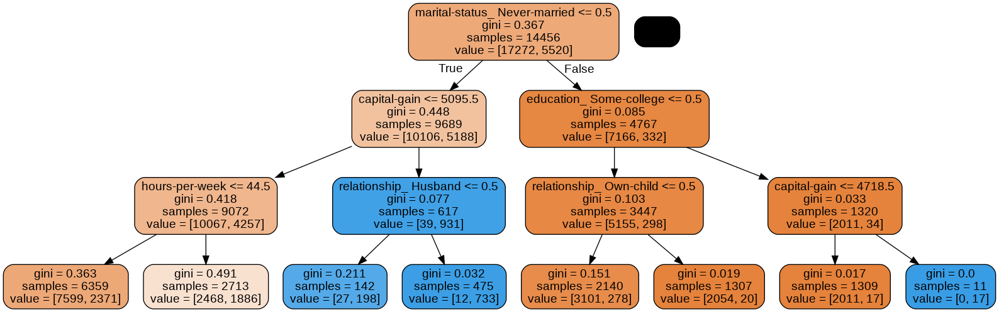

# Random Forest Classifier 🌳🌴🌲

### Bu çalışma standart bir veri bilimi projesinin en basit hali olarak düşünülebilir.
##### Veri tiplerini kontrol etme/düzeltme.
##### Açıklayıcı veri analizi ve görselleştirme.
##### Eksik verileri tahmin etme/veri atama.
##### Kategori tipindeki verileri one-hot encoding ile nümerik formata çevirme.
##### Veri setini eğitim ve test veri-setlerine ayırma.
##### Modeli eğitme ve test verisi üzerinde tahmin yapma.
##### Sınıflandırma başarı metriklerine bakma.
##### Karar ağacını görselleştirme.
##### Modelin yaptığı öznitelik sıralamasını görselleştirme.
